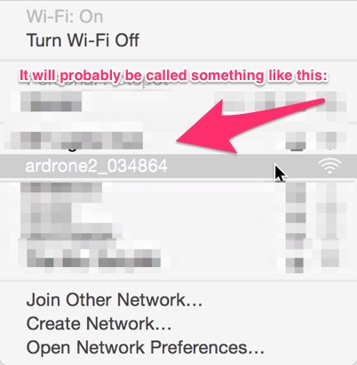
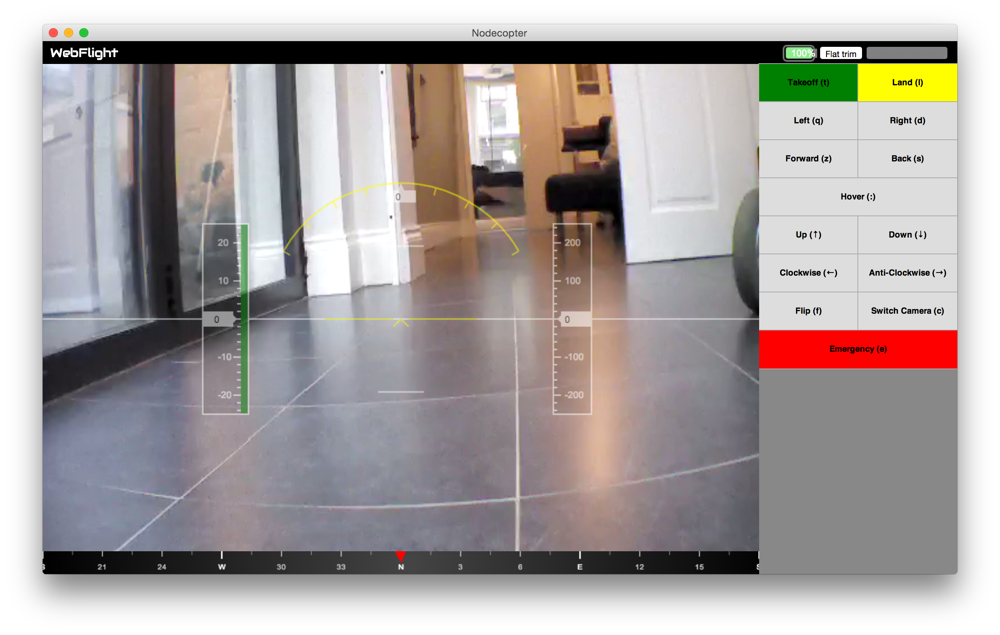

# Nodecopter.app

This is the [ardrone-webflight](http://eschnou.github.io/ardrone-webflight/) module for [NodeCopter](http://www.nodecopter.com/) packaged as a [node-webkit](https://github.com/rogerwang/node-webkit) application, NodeCopter and by extension this application makes it possible to fly the [Parrot AR Drone](http://ardrone2.parrot.com/) without using an [iOS](https://www.apple.com/ios/) or [Android](http://www.android.com/) device.  This opens up the possibility for people with profound disabilities, or those with other motor difficulties to be able to fly these consumer drones.  Much awesome ensues!

## OS X Install Instructions ##

1. [Download the latest version](https://github.com/andrew/Nodecopter.app/releases) from the releases page.
2. Find the zip file you just downloaded1 and move it to your Applications2 folder like this:

3. Installation done, you need to connect to the [Wi-Fi](http://www.wi-fi.org/) on your drone so that you're able to fly it.  Obviously your drone will need to have its battery plugged in before you can do this, so this is where you'll need a spare pair of hands if you can't do it yourself.

4. Once the battery is plugged in, wait a few seconds for it to make a beeping noise and for all of the rotors to do a little shimmy one at a time.  It's at this point the drone is ready and you'll be able select its name from the Wi-Fi menu in your Mac menubar:

## Usage ##

__AFTER__ your Mac has connected to the drones Wi-Fi, navigate to your Applications2 folder and open the NodeCopter application.  You'll see that the application is divided into two parts, on the left is the video feed coming from the drone and on the right are all of the controls you'll need to fly your drone.

## Controlling the Drone ##

To control the drone you have a couple of options, you can either click on the buttons in the control section of the application using your mouse or you can press the relevant keys on the keyboard to carry out the same action.  Those keys are:

* `z` = Forward
* `s` = Backwards
* `q` = Slide Left
* `d` = Slide Right
* `↑
` = Go Higher
* `↓
` = Go Lower
* `←
` = Clockwise
* `→
` = Anti-Clockwise
* `f` = Perform a flip in the current direction of movement
* `c` = Switch video feed between front/bottom camera
* `e` = Recover from an emergency after a crash
* `t` = Take off
* `l` = Land
* `:` = Hover

When you select any of these actions the drone will carry out that action until you tell it to something else. So if you press the letter `z` the drone will fly forward until you either press `z` again or - for instance - press `d` to get the drone to start sliding to the right. The obvious exceptions are the Takeoff (`t`) and Land (`l`) buttons because they, you know, just cause the drone to take off and land!

## Accessibility Yay! ##

This means that you can use a whole host of [alternative input devices](http://askjan.org/media/altinput.html) to fly these drones, all you need to be able to do is press keys on the keyboard.  So you can, like me, use a [Buddy Button](http://www.ablenetinc.com/assistive-technology/switches/buddy-button-and-big-buddy) with the on-screen keyboard application [Keystrokes](http://www.assistiveware.com/product/keystrokes), or you could use [DragonDictate for Mac](http://www.nuance.com/for-individuals/by-product/dragon-for-mac/dragon-dictate/index.htm) and simply say the keystrokes out loud.  But it doesn't really matter, you can use whichever accessibility tools you find easiest and you should be able to fly the perfectly!

By the way, if you're quadriplegic and record some awesome flying footage from your drone, [Stuart](mailto:contact@robotsandcake.org) from [Robots and Cake](https://robotsandcake.org/) would like to see it!

1 This will probably be: __/Users/[yourusername]/Downloads__ on a Mac.

2 This is: __/Applications__ on a Mac.