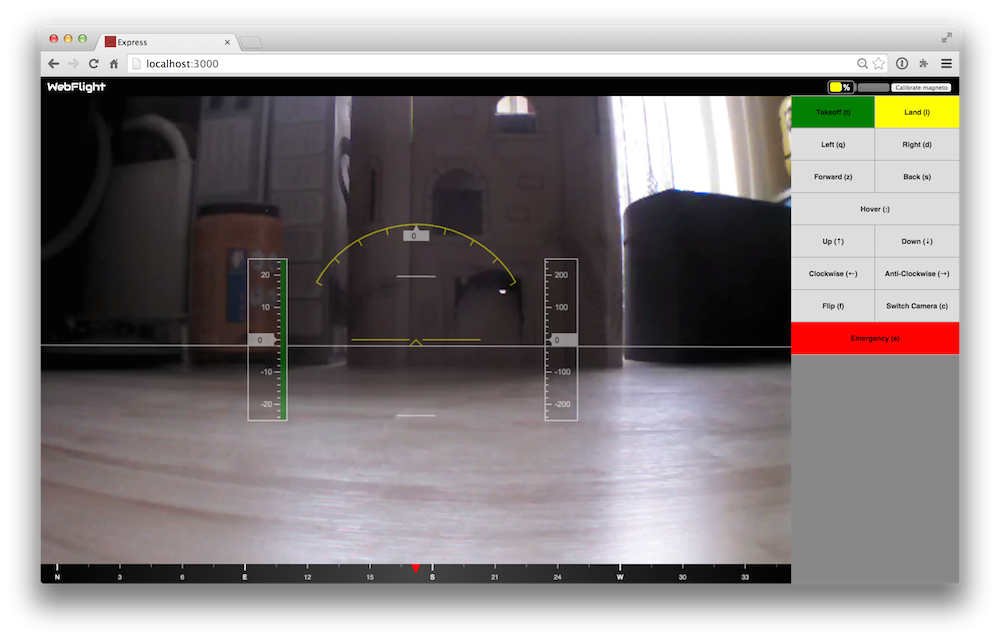

# webflight onscreen-keyboard plugin

This is a plugin for the browser-based AR.Drone ground control station
[webflight](http://eschnou.github.io/ardrone-webflight/) that adds on screen buttons for control.



## Running the software

You will need the
[ardrone-webflight](https://github.com/eschnou/ardrone-webflight) and
webflight-onscreen-keyboard repos:

```
git clone git://github.com/eschnou/ardrone-webflight.git
git clone git://github.com/andrew/webflight-onscreen-keyboard.git
```

Run `npm install` for each:

```
(cd ardrone-webflight && npm install)
(cd webflight-onscreen-keyboard && npm install)
```

Plus `bower install` for webflight:

```
npm install -g bower
(cd ardrone-webflight && bower install)
```

Link `webflight-onscreen-keyboard` into webflight's `plugins` directory:

```
(cd ardrone-webflight/plugins && ln -s ../../webflight-onscreen-keyboard onscreen-keyboard)
```

Copy ardrone-webflight's `config.js.example` to `config.js`:

```
(cd ardrone-webflight && cp config.js.example config.js)
```

Add `"onscreen-keyboard"` to the `plugins` array in `config.js`
and remove or comment out `"pilot"`
so it looks something like this:

```javascript
var config = {
  plugins: [
  "hud"
  , "onscreen-keyboard"
  , "video-stream"
  , "battery"
  ]
};

module.exports = config;
```

### Start the server

Now you can start the webflight server:

```
(cd ardrone-webflight && node app.js)
```

Point your browser at http://localhost:3000/
